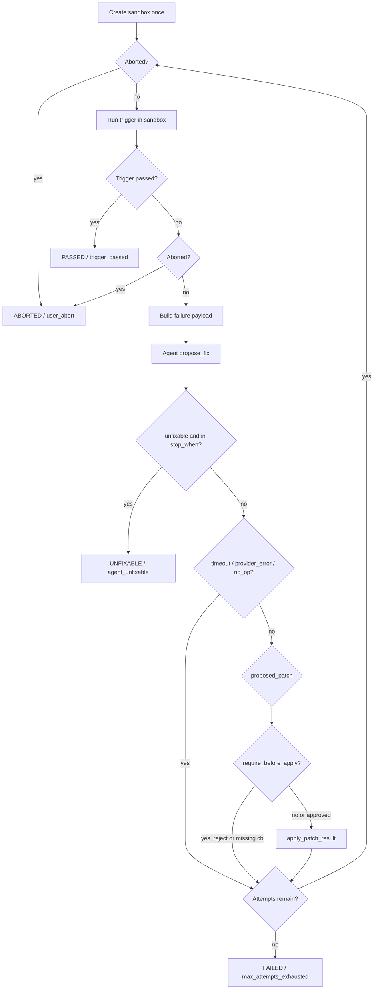

# Architecture

## Layers

```
getworktree/cli.py                 Typer entrypoint, wires flags to commands
getworktree/commands/<name>/       One package per CLI subcommand
  command.py                       Orchestration: calls core/common, handles typer.Exit
  models.py                        Pydantic outcome model(s) for the command
  renderers.py                     Rich console rendering, kept out of command.py
getworktree/core/                  Business logic, no Typer/CLI concerns
  bootstrap.py                     Creates/repairs the .worktree/ directory tree
  agents/{base,local,factory}.py   Agent adapter protocol + local provider
  config/{generator,loader,models,context}.py
                                   Defaults write + load/validate + typed models + repo context
  db.py                            SQLite token-usage ledger (for future metering)
  git_sandbox.py                   Isolated `git worktree` sandbox lifecycle
  loops/seeder.py                  Seeds packaged starter loop YAML files
  loops/patch.py                   Unified-diff validate/apply in sandbox
  loops/runner.py                  Iteration controller (attempt state machine)
  loops/safety.py                  Repeat-failure / no-op / session-timeout policy
  templates/loops/*.yml            Packaged starter loop definitions
getworktree/common/                Shared, dependency-light helpers
  constants.py, fs.py, utils.py, schema_validation.py
getworktree/schemas/                Versioned JSON Schemas (config_v1.json, loop_v1.json)
```

Not every command has all three files (e.g. `status` has only `command.py`) — add
`models.py`/`renderers.py` when a command's output/result grows non-trivial.

## Adding a new command

1. Create `getworktree/commands/<name>/{__init__.py,command.py}` (add `models.py`/
   `renderers.py` once output grows past a couple of lines).
2. Implement `<name>_command(...)` in `command.py`, following the
   [Result/Outcome pattern](code-conventions.md) for anything that can partially fail.
3. Register it in [getworktree/cli.py](../../getworktree/cli.py) with `@app.command(name="...")`.
4. Add tests under `tests/commands/<name>/` mirroring [tests/commands/init](../../tests/commands/init).

## The `.worktree/` directory

`bootstrap_worktree` ([getworktree/core/bootstrap.py](../../getworktree/core/bootstrap.py))
creates this layout inside a Git repo, analogous to `.git/`:

```
.worktree/
  .meta/bootstrap.json   status, tool_version, initialized_at
  config.json            V1 config, validated against schemas/config_v1.json
  loops/                 seeded + user loop definitions (validated against loop_v1.json)
  sessions/, artifacts/, tmp/, logs/
  token_audit.db          SQLite token/cost ledger (getworktree/core/db.py)
```

Bootstrap is idempotent and never deletes user data; it only creates missing
subdirectories and repairs metadata.

## Sandboxes

`GitSandboxManager` / `sandbox_scope` ([getworktree/core/git_sandbox.py](../../getworktree/core/git_sandbox.py))
own the V1 sandbox lifecycle used by loop execution.

### On-disk layout
- Base directory: `.worktree/sandboxes/`
- Checkout path: `.worktree/sandboxes/<session_id>/`
- Throwaway branch: `worktree/sandbox-<session_id>`
- Default `session_id`: `sbx_` + 8 lowercase hex chars

### Create
- Primary API: `create_sandbox_result` → `SandboxCreateResult` (`ok` /
  `capacity_exceeded` / `git_failed` / `not_initialized` / `unreadable_config`)
- `create_sandbox` is a thin raise-on-error wrapper over the result API
- Base ref: current branch when it is a real branch name; otherwise
  `sandbox.base_ref` from config (default `HEAD`)
- Refuses create when active sandbox **directories** ≥
  `sandbox.max_active_sandboxes` (default `3`) without leaving a partial
  session claim on the capacity path

### Cleanup policy
`should_cleanup_sandbox(auto_clean, keep_on_failure, command_passed)`:

| auto_clean | keep_on_failure | command_passed | clean? |
|------------|-----------------|----------------|--------|
| false | * | * | no |
| true | false | * | yes |
| true | true | True | yes |
| true | true | False | no (retain failed run) |
| true | true | None | yes (unclassified / aborted early) |

`cleanup_sandbox` is idempotent: `git worktree remove` (force by default),
best-effort `git branch -D`, then `git worktree prune`. Partial state (missing
dir or branch) must not raise.

### Context manager
`sandbox_scope(cwd, session_id=None, *, auto_clean=None, keep_on_failure=None)`
creates one sandbox, yields `SandboxSession`, and on exit applies the policy
above. Explicit kwargs override config; callers set `session.command_passed`
before leaving the scope. Body exceptions are never swallowed.


## Trigger runner

`run_trigger` ([getworktree/core/loops/trigger.py](../../getworktree/core/loops/trigger.py))
executes a loop trigger as **argv only** (`shell=False`) with `cwd` set to the
sandbox (or any working directory the caller provides).

### Inputs
- `command` + `args` (list; empty allowed)
- `cwd` — must be an existing directory or result is `cwd_missing`
- `timeout_seconds` (≥ 1) — kills the direct child on expiry
- `env` — `None` inherits the parent env; a mapping **replaces** the child env
- `log_dir` — optional artifact directory

### Result (`TriggerRunResult`)
Statuses: `passed`, `failed`, `timeout`, `spawn_failed`, `cwd_missing`.
`ok` is true only for `passed`. Captures full stdout/stderr (UTF-8 with
replacement), `exit_code` (`None` on timeout/spawn/cwd miss), `timed_out`,
`duration_ms`, and ISO-8601 `started_at` / `finished_at`.

Never prints or calls `sys.exit`. Classified outcomes do not raise.

### Artifacts (when `log_dir` is set)
Written atomically under `log_dir`:
- `trigger_stdout.log`
- `trigger_stderr.log`
- `trigger_meta.json` — `command`, `args`, `cwd`, `exit_code`, `timed_out`,
  `status`, `duration_ms`, `started_at`, `finished_at` (`indent=2`)

Artifact I/O failures become `warnings` and do **not** reclassify a successful
process outcome.

## Failure payload builder

`build_failure_payload` ([getworktree/core/loops/payload.py](../../getworktree/core/loops/payload.py))
turns a `TriggerRunResult` plus sandbox path into a bounded
`AgentFailurePayload` for agent adapters. Pure data assembly: no network, no
agent calls, no sandbox/git mutation.

### Include tokens (`context.include`)
| Token | Effect |
|-------|--------|
| `trigger_output` | Attach truncated `stdout`/`stderr` with `*_truncated` flags |
| `changed_files` | Copy caller-supplied path list onto the payload (no git) |
| `relevant_source` | Read selected source files into `files[]` |

Identity fields always set: `command`, `args`, `trigger_status`, `exit_code`,
`timed_out`, `duration_ms`. `include=[]` yields identity only.

### Caps (defaults)
- `max_trigger_chars=80_000` per stream; truncated streams append
  `\n...[truncated, original_chars=<n>]`
- `max_files=20`, `max_file_bytes=64_000` for `relevant_source`
- Candidate paths: regex extract from trigger streams (common source suffixes)
  ∪ caller `changed_files`; normalized under sandbox; sorted; de-duped
- Skips recorded in `omissions` with reason:
  `missing` | `outside_sandbox` | `directory` | `binary` | `max_files` |
  `max_file_bytes`
- Symlink escape outside the sandbox → `outside_sandbox` (no content)

## Patch apply engine

`apply_patch_result` ([getworktree/core/loops/patch.py](../../getworktree/core/loops/patch.py))
validates and applies agent patches to a sandbox tree. Strategy is
**`unified_diff` only**. Callers pass limits; the engine does not load config.
Never commits or stages. Classified outcomes do not raise.

### API
`apply_patch_result(*, sandbox_path, unified_diff, max_files, max_patch_kb,
reject_binary_changes=True, check_only=False) -> PatchApplyResult`

### Pre-apply validation order
1. empty/whitespace diff → `empty_diff`
2. UTF-8 byte size > `max_patch_kb * 1024` → `too_large`
3. parse failure → `invalid_diff`
4. distinct target files > `max_files` → `too_many_files`
5. binary markers (`Binary files … differ`, `GIT binary patch`) when
   `reject_binary_changes` → `binary_rejected`
6. absolute / `..` / sandbox escape paths → `unsafe_path`
7. missing sandbox directory → `sandbox_missing`

### Apply
Uses `git apply --verbose` with `cwd=sandbox_path` (no `--unsafe-paths`).
`check_only=True` adds `--check` and does not write. `git apply` reject is
atomic (working tree unchanged on failure) → status `conflict`. Success →
`applied` or `checked_ok` with sorted unique POSIX `touched_files`.

### Statuses
`applied` | `checked_ok` | `empty_diff` | `too_large` | `too_many_files` |
`binary_rejected` | `unsafe_path` | `invalid_diff` | `conflict` |
`sandbox_missing` (`ok` only for `applied` / `checked_ok`).

## Agent adapter

`getworktree/core/agents/` owns the provider boundary for loop fix requests.

### Contract
- Protocol: `AgentAdapter.propose_fix(request: AgentRequest) -> AgentResponse`
- Factory: `get_agent_adapter(provider, *, config=None)` — **v1 supports `local`
  only**; any other provider raises `ValueError` (`AGENT_PROVIDER_UNSUPPORTED`)
- Request carries `mode`, `AgentFailurePayload`, `sandbox_path`,
  `timeout_seconds`, and optional model/endpoint/temperature/max_tokens
- Response statuses: `proposed_patch` | `no_op` | `unfixable` | `timeout` |
  `provider_error` (`ok` only for `proposed_patch`)
- Adapters must not apply patches or mutate the sandbox beyond the child process

### Local provider (`LocalAgentAdapter`)
Resolves argv from `WORKTREE_LOCAL_AGENT_CMD` (`shlex.split`) or default
`worktree-local-agent` on `PATH`.

| Channel | Content |
|---------|---------|
| cwd | `request.sandbox_path` |
| stdin | JSON serialization of `AgentRequest` (UTF-8) |
| stdout | JSON matching `LocalAgentStdout` (`extra=forbid`) |
| timeout | wall clock `request.timeout_seconds` → status `timeout` |

Stdout mapping: `unfixable=true` → `unfixable`; non-empty `unified_diff` →
`proposed_patch`; else `no_op`. Invalid/missing JSON, spawn failures, and schema
violations → `provider_error`. Classified outcomes never raise.

## Iteration controller

`run_loop_iteration` ([getworktree/core/loops/runner.py](../../getworktree/core/loops/runner.py))
owns one full loop **session** attempt cycle. No Rich printing; returns
`LoopRunResult` only. Engines are injected for tests (`run_trigger_fn`,
`apply_patch_fn`, `agent`, sandbox create/cleanup, etc.).

### Attempt flowchart



### Max attempts
```text
effective = caller_max_attempts or loop.iteration.max_attempts
effective = min(effective, config.loop.max_attempts_hard_limit)
```
`effective < 1` → `configuration_error` (no attempts).

### Final statuses / stop_reason
| status | stop_reason examples |
|--------|----------------------|
| `PASSED` | `trigger_passed` |
| `FAILED` | `max_attempts_exhausted`, `sandbox_create_failed`, `configuration_error` |
| `UNFIXABLE` | `agent_unfixable` |
| `ABORTED` | `user_abort` (terminal even if `user_abort` missing from `stop_when`) |

### Sandbox / approval
- One sandbox per session; `session.command_passed` is `True` only on final
  `PASSED`, `False` on FAILED/UNFIXABLE, `None` on ABORTED
- Cleanup via `should_cleanup_sandbox` using loop sandbox flags (overridable)
- When `approval.require_before_apply` is true: call `approve_patch(diff)`;
  missing callback → `configuration_error` / `approval_callback_missing`

### Hooks
- `abort_event` / `is_aborted` checked before attempt, after trigger, after
  agent, before/after patch
- `on_event(name, payload)` and `on_attempt_end(record)` for UX/history

## Safety controls

`getworktree/core/loops/safety.py` holds pure helpers + `SafetyState`; the
iteration controller evaluates them at checkpoints.

| Tripwire | Threshold | Config | `stop_reason` | Final status |
|----------|-----------|--------|---------------|--------------|
| Repeat failure signature | 3 consecutive identical failed triggers | `loop.detect_repeat_failures` (false disables **only** this) | `repeat_failure_signature` | `FAILED` |
| Agent no-op streak | 2 consecutive `no_op` | always on | `agent_no_op_streak` | `FAILED` |
| Session wall-clock | `session_timeout_seconds` (default `sandbox.default_timeout_seconds`) | always on when > 0 | `session_timeout` | `FAILED` |
| User abort | abort event / `is_aborted` | always on | `user_abort` | `ABORTED` |

### Failure signature
`failure_signature(trigger_status, exit_code, stdout, stderr)` → full sha256 hex
of `status|exit_code|stdout_tail|stderr_tail` (tails: last 4000 chars, whitespace
collapsed). Successful trigger resets the consecutive signature counter; a
different signature also resets it.

### Session timeout checkpoints
Checked before each attempt starts and before the agent call. Does not cancel an
in-flight trigger/agent; if the agent returns after the deadline, the next
checkpoint still stops with `session_timeout`.

### Abort
CLI should set the same abort flag on SIGINT and let the controller finish
cleanup (`should_cleanup_sandbox` with `command_passed=None` on abort).

## Packaged resources

Schemas and loop templates ship inside the installed package and are read via
`importlib.resources.files(...)` (see shared `CONFIG_VALIDATOR` in
`common/schema_validation.py` and `LOOP_VALIDATOR` in `core/loops/seeder.py`)
rather than relative filesystem paths, so they work correctly when installed as a
wheel.
